# Kasparro Agentic Facebook Performance Analyst 🚀

[](https://www.python.org/downloads/)
[](https://opensource.org/licenses/MIT)
[]()

A multi-agent system that autonomously diagnoses Facebook Ads performance, identifies likely root causes of ROAS fluctuations, and recommends data-driven creative improvements. The design separates **quantitative analysis** (Pandas) from **reasoning** (LLM), aiming for reliable, auditable insights.

> **Note:** the system in this repository supports LLM-based reasoning (Groq / Llama-3) *optionally*. The default configuration runs rule-based analysis only — no API keys required.

---

## ⚡ Quick Start

### 1. Clone & install
```bash
git clone https://github.com/Hargovind-Ahirwar-1009/kasparro-agentic-fb-analyst-Hargovind-Ahirwar.git
cd kasparro-agentic-fb-analyst-Hargovind-Ahirwar
python -m venv .venv
source .venv/bin/activate        # Windows PowerShell: .venv\Scripts\Activate.ps1
pip install -r requirements.txt
```

### 2. Configure
Create a `.env` in the repo root (only needed if you enable LLM mode):
```text
# .env (example)
# GROQ_API_KEY=your_groq_api_key
# GROQ_MODEL=llama-3.3-70b-versatile
```

Edit `config/config.yaml` to set dataset path and thresholds.

### 3. Data
Place your CSV in:

```
data/synthetic_fb_ads_undergarments.csv
```

**Suggested columns** (minimum):  
`date, spend, impressions, clicks, ctr, purchases, revenue, roas, creative_message, campaign_name`

### 4. Run the analysis
**Rule-based (default — no LLM needed):**
```bash
python src/orchestrator/run.py "Analyze why ROAS dropped last week and suggest creative improvements."
```

**LLM-enabled (optional):**
```bash
RUN_USE_LLM=true python src/orchestrator/run.py "Analyze why ROAS dropped last week and suggest creative improvements."
```

---

## 🧩 Architecture & Agent Roles

This project uses a multi-agent orchestration pattern to separate responsibilities and improve auditability.

### Diagram (Mermaid)

```mermaid
flowchart TD
    User([User Query]) --> Planner[Planner Agent]
    Planner -->|Metrics_Strategy| DataAgent[Data Agent]

    subgraph Quantitative_Layer["📊 Quantitative Layer"]
        DataAgent -->|Aggregated_Stats| InsightAgent[Insight Agent]
    end

    subgraph Reasoning_Layer["🧠 Reasoning Layer"]
        InsightAgent -->|Hypothesis| Evaluator[Evaluator Agent]
        Evaluator -->|Confidence_Score| Decision{Score > 0.7?}
    end

    subgraph Action_Layer["🎯 Action Layer"]
        Decision -->|Yes| Creative[Creative Agent]
        Decision -->|No| Report[Report]
        Creative -->|New_Ad_Copy| Report
    end

```


---

## 🔍 Agent Breakdown

| Agent | Role | Technology |
|---|---:|:---|
| **Planner** | Decomposes user queries into tasks | Deterministic Python |
| **Data Agent** | Computes ROAS, CTR, aggregates (no LLM math) | Pandas |
| **Insight Agent** | Generates qualitative hypotheses from summary | LLM (optional) / rules |
| **Evaluator** | Validates textual claims against numbers (prevents hallucinations) | Logic + statistical tests |
| **Creative Agent** | Rewrites underperforming ad copy for A/B testing | LLM (optional) / heuristics |

---

## 🛡️ Validation & Guardrails

Evaluator Agent acts as an internal auditor:

- **Input:** textual hypothesis (e.g., “Creative fatigue caused CTR drop”).
- **Verification:** cross-check against Data Agent metrics (ROAS/CTR changes).
- **Scoring:** compute a confidence score (stat test or heuristic).
- **Action:** if `confidence < threshold` (default 0.7) — flag the insight and **do not** generate creatives automatically.

This mechanism reduces the chance of optimizing from false or unsupported claims.

---

## 📂 Outputs

For every run, the system writes the following artifacts into `reports/`:

1. `report.md` — executive, human-readable summary  
2. `insights.json` — structured hypotheses and validation scores  
3. `creatives.json` — suggested “before vs after” ad copy

---

## 🔎 Example Output (excerpt from `report.md`)

### 1. Executive Summary
**Diagnosis:** Efficiency dropped due to Creative Fatigue.  
**Confidence:** 95% (Verified)

### 2. Key Trends

| Date       | Spend   | ROAS | CTR   |
|------------|---------:|:----:|:-----:|
| 2025-03-24 | $10,000 | 2.1  | 0.85% |
| 2025-03-31 | $12,500 | 1.4  | 0.52% |

### 3. Recommended Actions
- **Original:** "Buy our soft boxers."  
- **Improved:** "Ends Tonight: The Softest Boxers You'll Ever Wear. 5-Star Rated."

---

## ⚙️ Configuration

Example `config/config.yaml` snippet:
```yaml
thresholds:
  low_ctr: 0.01           # Ads below this CTR are flagged for rewrite
  confidence_min: 0.7     # Minimum score to trigger creative generation

system:
  model: "llama-3.3-70b-versatile"
```

---

## 📁 Repository Structure

```
kasparro-agentic-fb-analyst/
├── config/              # config/config.yaml
├── data/                # raw datasets (CSV)
├── logs/                # execution logs
├── prompts/             # prompt templates (.md)
├── reports/             # generated outputs (report.md, insights.json, creatives.json)
├── src/
│   ├── agents/          # Planner, Data, Insight, Evaluator, Creative
│   └── orchestrator/    # run.py (main runner)
├── tests/               # unit tests
└── README.md            # this document
```

---

## 🧪 Tests
Run:
```bash
pytest -q
```

---

## 📌 Author & Version
**Author:** Hargovind Ahirwar  
**Version:** v1.0
